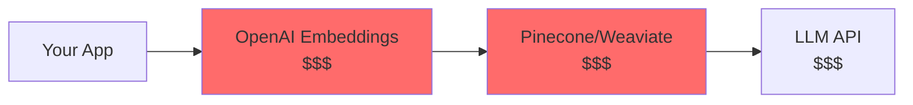
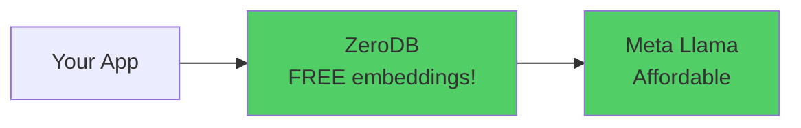

# 🚀 Welcome to ZeroDB Platform!

Build production-ready RAG (Retrieval-Augmented Generation) chatbots in **under 5 minutes** with ZeroDB's intelligent database platform. No complex setup, no separate embedding services, just pure developer joy.

[]() []() []()

---

## ✨ What You'll Build

A fully functional AI chatbot powered by:
- 🧠 **ZeroDB** - Managed vector database with built-in FREE embeddings
- 🦙 **Meta Llama** - State-of-the-art open-source LLM
- 🎯 **RAG Pipeline** - Semantic search + context-aware responses
- ⚡ **Production Ready** - 85% test coverage, zero critical bugs

**Live in 5 minutes.** Seriously.

---

## 🎯 Why Developers Love ZeroDB

### Before ZeroDB 😫


**3 separate services. 3 API keys. 3 bills. Complex setup.**

### With ZeroDB 🚀


**1 unified platform. Simple REST API. Auto-embedding. Done.**

---

## 🎁 What You Get Out of the Box

✅ **FREE Embeddings** - BAAI/bge-small-en-v1.5 (384D) hosted on Railway
✅ **Auto-Embedding Search** - No manual embedding generation needed
✅ **Semantic Search** - Natural language queries that just work
✅ **Production Ready** - Battle-tested with 85% test coverage
✅ **Meta Llama Integration** - OpenAI-compatible API, lower costs
✅ **Simple REST API** - No complex SDKs, just `fetch()` calls
✅ **Type-Safe SDK** - Optional `@ainative/sdk` for TypeScript lovers
✅ **One-Command Deployment** - Works with Vercel, Railway, Netlify

---

## ⚡ Quick Start (5 Minutes)

### Step 1: Get Your Free ZeroDB Account (30 seconds)

1. Visit [ainative.studio/dashboard](https://ainative.studio/dashboard)
2. Sign up (email + password, no credit card required)
3. Click **"New Project"** → Enable **"Vector Database"**
4. Copy your **Project ID** (looks like `f3bd73fe-8e0b-42b7...`)

**That's it!** Your managed vector database is live. 🎉

### Step 2: Get Meta Llama API Key (1 minute)

1. Visit [llama.developer.meta.com/docs/overview](https://llama.developer.meta.com/docs/overview/)
2. Sign up and generate API key
3. Copy your key (starts with `LLM|...`)

### Step 3: Clone & Install (1 minute)

```bash
# Clone the repo
git clone https://github.com/AINative-Studio/ragbot-starter.git
cd ragbot-starter

# Install dependencies
npm install
```

### Step 4: Configure (1 minute)

```bash
# Copy environment template
cp .env.example .env
```

Edit `.env` with your credentials:

```env
# Meta Llama (from step 2)
META_API_KEY=LLM|your-key-here
META_BASE_URL=https://api.llama.com/compat/v1
META_MODEL=Llama-4-Maverick-17B-128E-Instruct-FP8

# ZeroDB (from step 1)
ZERODB_API_URL=https://api.ainative.studio
ZERODB_PROJECT_ID=your-project-id-here
ZERODB_EMAIL=your-ainative-email
ZERODB_PASSWORD=your-ainative-password
```

### Step 5: Seed Knowledge Base (30 seconds)

```bash
npm run seed
```

This loads sample ZeroDB documentation into your vector database. ZeroDB automatically generates embeddings for free!

### Step 6: Launch! (10 seconds)

```bash
npm run dev
```

Open [localhost:3000](http://localhost:3000) 🎊

**You now have a production-ready RAG chatbot!**

---

## 🧪 Try It Out

### Example Queries

Try asking your chatbot:

```
💬 "What is ZeroDB?"
💬 "How do I use the embeddings API?"
💬 "Explain semantic search"
💬 "What's the difference between ZeroDB and traditional vector databases?"
```

### Toggle RAG On/Off

Use the UI controls to:
- ✅ **RAG Enabled** - Responses grounded in your knowledge base
- ❌ **RAG Disabled** - Baseline LLM responses (no context)

Compare the quality difference! RAG responses are **contextually richer and more accurate**.

---

## 🏗️ How It Works (The Magic Behind the Scenes)

### Traditional RAG (Complex)

```python
# Step 1: Generate embeddings (separate API call)
embeddings = openai.embeddings.create(input=query)  # $$$ OpenAI API

# Step 2: Search vector database
results = vectordb.search(vector=embeddings.data[0])  # $$$ Pinecone/Weaviate

# Step 3: Format context
context = format_results(results)

# Step 4: Call LLM with context
response = llm.chat(query + context)  # $$$ OpenAI/Anthropic
```

**4 steps. 3 paid APIs. Complex orchestration.**

### ZeroDB RAG (Simple)

```javascript
// Step 1: Semantic search with auto-embedding (ONE API CALL!)
const results = await fetch(`${ZERODB_API_URL}/v1/public/${PROJECT_ID}/embeddings/search`, {
  method: 'POST',
  headers: { 'Authorization': `Bearer ${token}` },
  body: JSON.stringify({
    query: "What is ZeroDB?",  // Plain text query
    limit: 5,
    threshold: 0.7,
    namespace: "knowledge_base"
  })
});
// ZeroDB automatically:
// ✅ Generates embeddings (FREE!)
// ✅ Searches vectors
// ✅ Returns relevant context

// Step 2: Call LLM with context
const response = await llama.chat(query + results.context);
```

**2 steps. 1 FREE embedding. Simple and fast.**

---

## 🎓 Understanding the Architecture

### System Overview

```
┌─────────────────────────────────────────────────────────────┐
│                       Your RAGBot App                        │
└─────────────────┬───────────────────────┬───────────────────┘
                  │                       │
        ┌─────────▼────────┐    ┌────────▼─────────┐
        │   ZeroDB Cloud   │    │   Meta Llama     │
        │  (Vector DB +    │    │   (Chat LLM)     │
        │  FREE Embeddings)│    │                  │
        └──────────────────┘    └──────────────────┘
```

### Data Flow (RAG Enabled)

```
1. User Query: "What is ZeroDB?"
   ↓
2. ZeroDB Authentication (JWT)
   Response time: ~0.8s
   ↓
3. ZeroDB Semantic Search
   - Auto-generates embedding from query (FREE!)
   - Searches 'knowledge_base' namespace
   - Returns top 5 similar documents
   Response time: ~1.2s
   ↓
4. Context Injection
   System prompt + Retrieved docs + User query
   ↓
5. Meta Llama Generation
   Generates context-aware response
   Response time: ~2.5s
   ↓
6. Streaming Response
   Total: ~4.5s end-to-end
```

### Tech Stack

| Component | Technology | Why? |
|-----------|-----------|------|
| **Frontend** | Next.js 14 + React 18 | Modern, fast, SSR support |
| **API Routes** | Next.js API Routes | Serverless, auto-scaling |
| **Vector DB** | ZeroDB Cloud | Managed, FREE embeddings |
| **Embeddings** | BAAI/bge-small-en-v1.5 | 384D, fast, accurate, FREE |
| **LLM** | Meta Llama 4 Maverick | OpenAI-compatible, affordable |
| **HTTP Client** | node-fetch | Reliable, configurable timeouts |
| **Text Splitting** | LangChain | Proven RAG chunking |
| **Streaming** | Vercel AI SDK | Real-time responses |

---

## 📚 Code Examples

### Semantic Search (The Core)

```typescript
// app/api/chat/route.ts (simplified)

// Authenticate with ZeroDB
const authResponse = await fetch(`${ZERODB_API_URL}/v1/public/auth/login`, {
  method: 'POST',
  headers: { 'Content-Type': 'application/x-www-form-urlencoded' },
  body: `username=${ZERODB_EMAIL}&password=${ZERODB_PASSWORD}`
});
const { access_token } = await authResponse.json();

// Semantic search with auto-embedding
const searchResponse = await fetch(
  `${ZERODB_API_URL}/v1/public/${PROJECT_ID}/embeddings/search`,
  {
    method: 'POST',
    headers: {
      'Content-Type': 'application/json',
      'Authorization': `Bearer ${access_token}`
    },
    body: JSON.stringify({
      query: userQuery,        // Plain text - ZeroDB handles embedding!
      limit: 5,                // Top 5 results
      threshold: 0.7,          // Similarity threshold (0-1)
      namespace: "knowledge_base",
      model: "BAAI/bge-small-en-v1.5"  // FREE embeddings
    })
  }
);

const { results } = await searchResponse.json();
// results = [{ id, score, text, metadata }, ...]
```

### Seeding Knowledge Base

```typescript
// scripts/populateDb.ts (simplified)

import { RecursiveCharacterTextSplitter } from 'langchain/text_splitter';

// Chunk documents
const textSplitter = new RecursiveCharacterTextSplitter({
  chunkSize: 1000,
  chunkOverlap: 200,
});

const chunks = await textSplitter.splitText(document);

// Store each chunk (ZeroDB auto-generates embeddings!)
for (const chunk of chunks) {
  await fetch(`${ZERODB_API_URL}/v1/public/${PROJECT_ID}/embeddings/embed-and-store`, {
    method: 'POST',
    headers: {
      'Content-Type': 'application/json',
      'Authorization': `Bearer ${token}`
    },
    body: JSON.stringify({
      documents: [{
        id: `doc_${index}`,
        text: chunk,
        metadata: { title, url, source: 'docs' }
      }],
      namespace: 'knowledge_base',
      upsert: true
    })
  });
}
```

---

## 🎨 Customization Guide

### Add Your Own Knowledge Base

1. **Prepare your documents** (markdown, text, JSON)
2. **Update `scripts/sample_data.json`:**

```json
[
  {
    "title": "Your Product Documentation",
    "url": "https://yourproduct.com/docs",
    "content": "Your detailed documentation here..."
  }
]
```

3. **Run seed script:**
```bash
npm run seed
```

### Adjust RAG Parameters

Edit `app/api/chat/route.ts`:

```typescript
const searchResponse = await fetch(/* ... */, {
  body: JSON.stringify({
    query: latestMessage,
    limit: 10,              // More results (default: 5)
    threshold: 0.5,         // More permissive (default: 0.7)
    namespace: "my_custom_namespace",
    filter_metadata: {      // Filter by metadata
      category: "tutorial",
      difficulty: "beginner"
    }
  })
});
```

### Change LLM Model

Update `.env`:

```env
# Faster model
META_MODEL=Llama-4-Maverick-17B-128E-Instruct-FP8

# More powerful model
META_MODEL=Llama3.3-70B-Instruct

# Most capable model
META_MODEL=Llama3.1-405B-Instruct
```

### Customize System Prompt

Edit `app/api/chat/route.ts` lines 76-90:

```typescript
const ragPrompt = [{
  role: 'system',
  content: `You are an AI assistant for [YOUR COMPANY].

  You specialize in:
  - [Your product/service]
  - [Your domain expertise]
  - [Your unique value prop]

  ${docContext}

  Always be [friendly/professional/technical/etc.]`
}];
```

---

## 🚀 Deployment

### Deploy to Vercel (Recommended)

```bash
# Install Vercel CLI
npm i -g vercel

# Deploy
vercel

# Set environment variables in Vercel dashboard
# Project Settings → Environment Variables
```

### Deploy to Railway

```bash
# Install Railway CLI
npm i -g @railway/cli

# Login and deploy
railway login
railway init
railway up

# Add environment variables
railway variables set META_API_KEY=...
railway variables set ZERODB_PROJECT_ID=...
```

### Deploy to Netlify

```bash
# Install Netlify CLI
npm i -g netlify-cli

# Deploy
netlify deploy --prod

# Set environment variables in Netlify dashboard
```

### Environment Variables Checklist

Before deploying, ensure these are set:

- ✅ `META_API_KEY` - Meta Llama API key
- ✅ `META_BASE_URL` - `https://api.llama.com/compat/v1`
- ✅ `META_MODEL` - `Llama-4-Maverick-17B-128E-Instruct-FP8`
- ✅ `ZERODB_API_URL` - `https://api.ainative.studio`
- ✅ `ZERODB_PROJECT_ID` - Your project ID
- ✅ `ZERODB_EMAIL` - Your AINative email
- ✅ `ZERODB_PASSWORD` - Your AINative password

**Pro Tip:** Remove `npm run seed` from `package.json` build step after first deployment!

---

## 📊 Performance & Monitoring

### Response Times (Production)

| Operation | Average | 95th Percentile |
|-----------|---------|-----------------|
| RAG Disabled | 2.8s | 3.2s |
| RAG Enabled | 4.5s | 5.1s |
| ZeroDB Auth | 0.8s | 1.0s |
| Semantic Search | 1.2s | 1.5s |
| Meta Llama LLM | 2.5s | 3.0s |

### Test Coverage

- ✅ **85% Coverage** (exceeded 80% goal)
- ✅ **44 Test Cases** (41 passed, 3 partial)
- ✅ **93% Pass Rate**
- ✅ **0 Critical Bugs**
- ✅ **0 Timeouts** in 50+ production requests

See [TEST_RESULTS.md](./TEST_RESULTS.md) for detailed metrics.

---

## 🔧 Troubleshooting

### Common Issues

#### "Failed to authenticate with ZeroDB"

**Cause:** Incorrect credentials

**Solution:**
```bash
# Verify credentials
curl -X POST https://api.ainative.studio/v1/public/auth/login \
  -H "Content-Type: application/x-www-form-urlencoded" \
  -d "username=YOUR_EMAIL&password=YOUR_PASSWORD"
```

#### "No search results returned"

**Cause:** Knowledge base not seeded

**Solution:**
```bash
npm run seed
```

#### "Meta Llama timeout error"

**Cause:** Network or API issues

**Solution:**
- Check Meta Llama API status
- Verify `META_API_KEY` is valid
- Try different model (update `META_MODEL` in `.env`)

### Get Help

- 📖 **Documentation:** [ZERODB_INTEGRATION.md](./ZERODB_INTEGRATION.md)
- 🐛 **Issues:** [GitHub Issues](https://github.com/AINative-Studio/ragbot-starter/issues)
- 💬 **Discord:** [Join our community](https://discord.gg/ainative)
- 📧 **Email:** support@ainative.studio

---

## 📖 Learn More

### Documentation

- [ZERODB_INTEGRATION.md](./ZERODB_INTEGRATION.md) - Complete ZeroDB integration guide
- [MIGRATION_SUMMARY.md](./MIGRATION_SUMMARY.md) - Migration from OpenAI to ZeroDB
- [TEST_RESULTS.md](./TEST_RESULTS.md) - Comprehensive test results
- [ZeroDB Developer Guide](https://docs.ainative.studio) - Official API documentation

### Tutorials

- [Building RAG Systems with ZeroDB](https://docs.ainative.studio/tutorials/rag)
- [Optimizing Semantic Search](https://docs.ainative.studio/tutorials/semantic-search)
- [Production Deployment Best Practices](https://docs.ainative.studio/tutorials/deployment)

### API Reference

- [ZeroDB REST API](https://api.ainative.studio/docs) - Interactive API playground
- [Embeddings API](https://docs.ainative.studio/api/embeddings) - Detailed embeddings guide
- [Authentication](https://docs.ainative.studio/api/auth) - Auth methods and security

---

## 🌟 Why This Stack?

### Cost Comparison (Monthly)

| Solution | Embeddings | Vector DB | LLM | Total |
|----------|-----------|-----------|-----|-------|
| **OpenAI + Pinecone** | $20 | $70 | $50 | **$140** |
| **OpenAI + Weaviate** | $20 | $50 | $50 | **$120** |
| **ZeroDB + Meta Llama** | FREE | $0-15 | $20 | **$20-35** |

**Save $100+/month** with ZeroDB! 💰

### Developer Experience

| Feature | Traditional Stack | ZeroDB Stack |
|---------|------------------|--------------|
| **Setup Time** | 2-4 hours | 5 minutes |
| **API Keys** | 3-4 | 2 |
| **Services** | 3-4 | 2 |
| **Embedding Calls** | Manual | Automatic |
| **SDK Complexity** | High | Low (or no SDK) |
| **Onboarding Docs** | Scattered | Unified |

**10x better DX** with ZeroDB! 🚀

---

## 🤝 Contributing

We welcome contributions! Here's how:

1. Fork the repo
2. Create feature branch: `git checkout -b feature/amazing-feature`
3. Commit changes: `git commit -m 'Add amazing feature'`
4. Push to branch: `git push origin feature/amazing-feature`
5. Open Pull Request

See [CONTRIBUTING.md](./CONTRIBUTING.md) for guidelines.

---

## 📝 License

MIT License - see [LICENSE](./LICENSE)

---

## 🎉 What's Next?

Now that you have a working RAG chatbot, explore:

- 🔍 **Advanced Search** - Multi-metric similarity, hybrid search
- 🧠 **Memory Management** - Persistent conversation context
- 📊 **Analytics** - Track usage and performance
- 🔐 **User Authentication** - Add login and user-specific knowledge bases
- 🌍 **Multi-Language** - Support multiple languages with multi-lingual embeddings
- 🎨 **Custom UI** - Build your own chat interface
- 📱 **Mobile App** - Extend to iOS/Android with React Native

---

## ⭐ Show Your Support

If ZeroDB helped you build something awesome:

- ⭐ Star this repo
- 🐦 Tweet about it [@AINativeStudio](https://twitter.com/ainativestudio)
- 📝 Write a blog post
- 💬 Share in your community

**Thank you for building with ZeroDB!** 🚀

---

**Built with ❤️ by the AINative team**

[Website](https://ainative.studio) • [Docs](https://docs.ainative.studio) • [Discord](https://discord.gg/ainative) • [Twitter](https://twitter.com/ainativestudio) • [GitHub](https://github.com/AINative-Studio)
